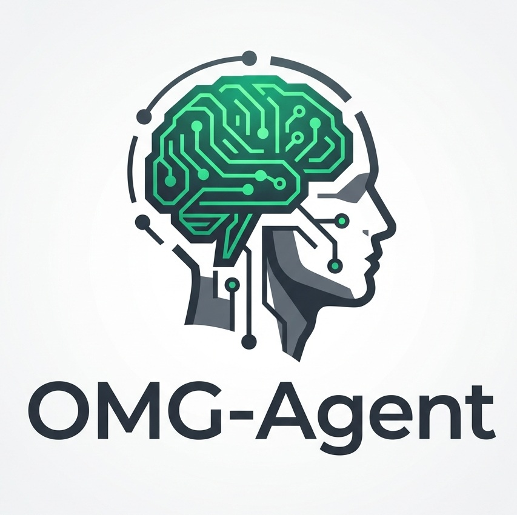

<div align="center">
  
  <h1>OMG-Agent</h1>

  <p>
    <strong>Open-sourced Mobile GUI Agent</strong>
    <br>
    开源、通用的移动端 GUI Agent 框架
  </p>

  <p>
    <a href="LICENSE">
      
    </a>
    
    
    
  </p>

  <p align="center">
    <a href="README.md">English</a> | <a href="README_zh.md">中文</a>
  </p>

  <br>
  
  <br>
  <br>
</div>

---

## 简介

OMG-Agent 是一个开源的移动端 GUI Agent 桌面客户端，通过自然语言指令驱动 AI 自动操作 Android 手机。

**核心特点：**
- 支持 AutoGLM 和 GELab-Zero 等手机 GUI 模型
- ADB 实时截图 + AI 任务执行
- 中英双语界面，深色/浅色主题
- 支持 OpenAI 兼容 API
- 支持安卓模拟器

> **⚠️ 免责声明**
>
> 本项目仅供学习研究和技术探索使用，**严禁用于任何商业用途**。使用本工具时，请遵守相关法律法规以及手机厂商、应用程序的使用条款和服务协议。用户因使用本项目产生的任何行为和后果，均由用户自行承担，与本项目及开发者无关。

## 快速开始

### 1. 环境准备

```bash
# 安装 ADB
scoop install adb  # Windows
brew install android-platform-tools  # macOS
apt install adb  # Linux (Ubuntu)
```

### 2. 安装运行

```bash
git clone https://github.com/safphere/OMG-Agent.git
cd OMG-Agent
pip install -r requirements.txt
python run.py
```

### 3. 手机配置

1. 开启「开发者选项」和「USB 调试」
2. 安装 [ADBKeyboard](https://github.com/nicekwell/ADBKeyboard/releases) 输入法
3. USB 连接手机，允许调试授权

### 4. 开始使用

1. 点击「刷新」检测设备
2. 点击「开始投屏」
3. 输入任务（如：打开微信发送消息给张三）
4. 点击「执行」

## 支持的模型

| 模型 | 来源 | 说明 |
|------|------|------|
| **AutoGLM-Phone-9B** | 智谱 AI | 手机 GUI 专用模型 |
| **GELab-Zero-4B-preview** | 阶跃星辰 | 手机 Agent 模型 |

这些模型都是专门针对手机 GUI 任务训练的，推荐使用。

## 文档
对于没有安卓手机的用户，可以参考 [模拟器配置指南](docs/emulator_setup_zh.md)。

- [环境配置详解](docs/setup_zh.md)
- [模型配置指南](docs/model-config_zh.md)
- [开发指南](docs/development_zh.md)

## 项目结构

```
OMG-Agent/
├── omg_agent/
│   ├── gui/           # GUI 界面
│   └── core/
│       ├── agent/     # AI Agent 核心
│       └── config.py  # 配置管理
├── assets/            # 资源文件
├── docs/              # 文档
└── run.py             # 启动入口
```

---

## 关于 Safphere

**Safphere** 是由算法工程师与高校极客组成的开源社区，专注于 AI 领域的技术探索与知识分享。

<p align="center">
  
</p>

<p align="center">
  
  &nbsp;&nbsp;&nbsp;&nbsp;
  
</p>


| 平台 | 链接 |
|------|------|
| GitHub | [github.com/safphere](https://github.com/safphere) |
| 微信公众号 | Safphere |
| 小红书 / 知乎 / 微博 | @Safphere |

⭐ 如果觉得项目有帮助，欢迎 **Star** 支持！

## 许可证

本项目采用 **Apache License 2.0 with Commons Clause** 许可证。

- ✅ 允许学习、研究、个人使用
- ✅ 允许修改和二次开发
- ❌ 禁止商业用途
- ⚠️ 使用时请注明出处

详见 [LICENSE](./LICENSE) 文件。

## 致谢

- [Open-AutoGLM](https://github.com/zai-org/Open-AutoGLM) — 智谱 AI 手机 GUI 模型
- [gelab-zero](https://github.com/stepfun-ai/gelab-zero) — 阶跃星辰手机 Agent 框架
- [ADBKeyboard](https://github.com/nicekwell/ADBKeyboard) — ADB 输入法

---

© 2025 [Safphere](https://github.com/safphere)
