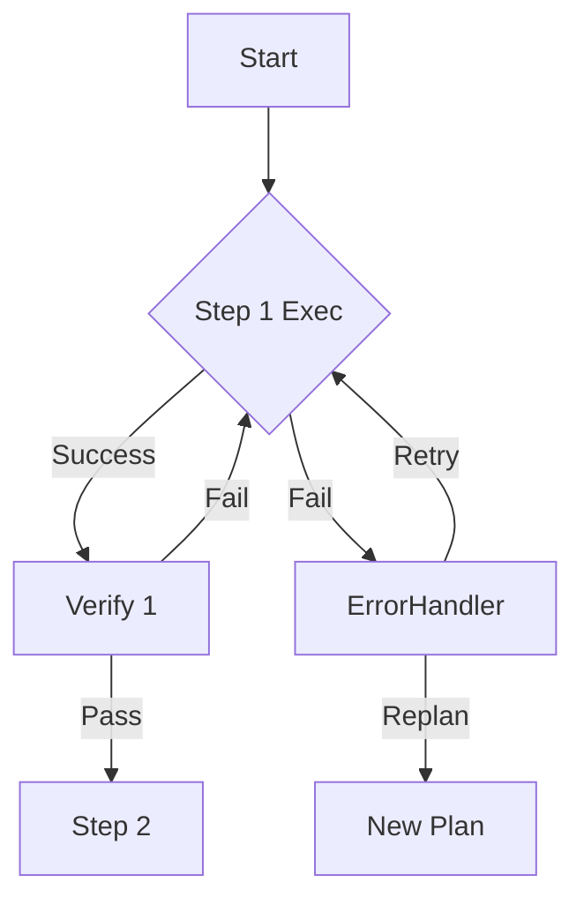

# OMG-Agent 复杂任务执行架构设计

## 1. 核心理念：认知分层 (Cognitive Layering)

面对复杂、繁琐任务，通过分层将其降维，把"大任务"拆解为"小闭环"。

- **L1 战略层 (Strategist)**: 负责整体规划、任务拆解、跨应用调度。（目前的 `TaskPlanner`）
- **L2 执行层 (Operator)**: 负责单个 APP 内的具体操作、UI 识别、报错处理。（目前的 `PhoneAgent`）
- **L3 记忆层 (Memory Bank)**: **(新增)** 独立于 Context 之外的结构化存储，用于跨步骤传递数据。

## 2. 关键设计模式

### 2.1 显式工作记忆 (Explicit Working Memory)

对于"查价格存备忘录"这类任务，最大的挑战是数据丢失。通过引入 **Memory Bank** 解决：

- **机制**：在 Action Space 中增加 `MEM_SAVE` 和 `MEM_READ` 动作。
- **示例流程**：
    1.  Agent 在淘宝看到价格 -> 执行 `action:MEM_SAVE key:mac_price value:3599`
    2.  Agent 即使经过了20步操作，Context 变了
    3.  打开备忘录 -> 执行 `action:TYPE value:$mac_price` (自动替换)

### 2.2 动态状态机 (Dynamic State Machine)

将线性的 `Step 1 -> 2 -> 3` 升级为带有容错的状态机：



- **验证(Verify)**: 每个关键步骤后必须跟随一个验证动作（检测特定文字/元素）。
- **回滚(Rollback)**: 如果 Step 3 失败且无法恢复，支持自动执行 `BACK` 直到回到 Step 1 的结束状态。

### 2.3 视觉锚点 (Visual Anchoring)

对于繁琐的“长列表查找”或“表单填写”：

- **OCR + 语义匹配**: 能够返回屏幕上特定文字的坐标，而不仅仅依赖 VLM 的模糊感知。
- **UI 树辅助**: 在复杂场景下结合 XML/Accessibility 树，实现精确点击。

---

## 3. 具体实施方案

### 3.1 增强 Planner (智能规划器)

让规划器具备"条件分支"能力。

**新版 TaskPlan 数据结构:**
```python
class TaskStep:
    description: str     # "搜索商品"
    action_guide: str    # "点击放大镜图标，输入关键词"
    success_criteria: str # "看到商品列表"
    timeout: int         # 30s
    on_fail: str         # "retry" or "jump_to_step_1"
    data_output: str     # "extracted_price" (期望从这步提取的数据)
```

### 3.2 增强 Loop Detection (死循环打破)

目前的循环检测是基于 Action 序列的。改进版将结合 Screen State：

- **Screen Hashing**: 对屏幕截图（去掉时间栏）做 Hash。
- **State Loop**: 如果 Action 变了，但 Screen Hash 没变，说明操作无效（按了按钮没反应）。
- **策略**: 
    - 第一次无效: `WAIT` 2秒
    - 第二次无效: `CLICK` 稍微偏移一点坐标
    - 第三次无效: `BACK` 重试

### 3.3 引入 "Human-in-the-loop" 主动求助

当 Agent 确信自己卡住（Confidence < 阈值），或者遇到高风险操作（支付、删除）时：

1. 暂停执行。
2. 弹窗/语音询问用户："我需要帮助，当前页面是...，我该点哪里？"
3. 用户可以用鼠标在投屏上点一下，或者输入语音指令。
4. Agent 学习这次操作，存入 Long-term Memory。

## 4. 针对"繁琐任务"的特殊优化

对于"给列表里前10个人点赞"这种重复繁琐任务：

1. **宏 (Macro) 识别**: Agent 识别出重复模式（Click -> Scroll -> Click -> Scroll）。
2. **高速执行模式**: 识别出模式后，不再每次都截图+LLM思考，而是直接生成批处理 ADB 指令执行。

## 5. 路线图 (Roadmap)

1. **Phase 1 (Done)**: 基础 ADB 控制，线性规划，文本历史。
2. **Phase 2 (Current Focus)**: 动态规划，错误恢复，环境感知。
3. **Phase 3 (Next)**: 
    - [ ] 实现 `MemoryBank` (变量存储)。
    - [ ] 引入 OCR 辅助精确点击。
    - [ ] 实现基于状态的验证机制 (Verification)。
